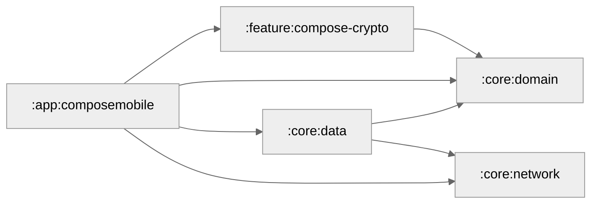

# Crypto-Modular-Application

### Module Graph

```mermaid
%%{
  init: {
    'theme': 'neutral'
  }
}%%

graph LR
  :core:data --> :core:domain
  :core:data --> :core:network
  :app:composemobile --> :feature:compose-crypto
  :app:composemobile --> :core:domain
  :app:composemobile --> :core:data
  :app:composemobile --> :core:network
  :feature:compose-crypto --> :core:domain
```

