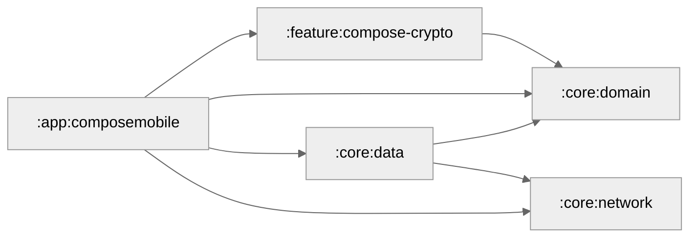

# Crypto-Modular-Application

A sample Android application demonstrating **Clean Architecture** and **Modularization** best practices. This project showcases how to structure a scalable, maintainable Android app using modern development patterns and technologies.

## 🎯 Overview

This project serves as a reference implementation for:

- **Multi-module architecture** with clear separation of concerns
- **Clean Architecture** principles (Domain, Data, Presentation layers)
- **Convention plugins** for consistent build configuration
- **Type-safe project accessors** for module dependencies
- **Scalable project structure** suitable for large teams

## 🏗️ Architecture

The application follows **Clean Architecture** principles with three main layers:

### 1. Domain Layer (`core:domain`)
- Contains business logic and use cases
- Defines repository interfaces
- Platform-independent pure Kotlin/Java code
- No Android dependencies

### 2. Data Layer (`core:data`, `core:network`)
- Implements repository interfaces from domain layer
- Handles data sources (remote, local)
- Network communication via Retrofit
- Data transformation and caching

### 3. Presentation Layer (`feature:*`, `app:*`)
- UI implementation (Compose/XML)
- ViewModels and UI state management
- Dependency injection with Hilt
- Feature-specific modules

## 📦 Module Structure

```
Crypto-Modular-Application/
├── app/                          # Application modules
│   ├── composemobile/           # Compose-based app implementation
│   └── xmlmobile/               # XML-based app implementation
├── core/                         # Core modules (shared across features)
│   ├── domain/                  # Business logic & entities
│   ├── data/                    # Repository implementations
│   └── network/                 # Network layer (Retrofit, OkHttp)
├── feature/                      # Feature modules
│   └── compose-crypto/          # Crypto feature (Compose UI)
└── build-logic/                  # Convention plugins
    └── convention/              # Custom Gradle plugins
```

### Module Graph



**Generate Module Graph:**
```bash
./gradlew createModuleGraph
```

## 🔌 Convention Plugins

The `build-logic` folder contains custom convention plugins that enforce consistent configuration across modules. This approach:

- ✅ Eliminates duplicated build script setup
- ✅ Provides single source of truth for configurations
- ✅ Avoids `buildSrc` pitfalls
- ✅ Enables composable, additive plugin architecture

### Available Convention Plugins

| Plugin | Purpose |
|--------|---------|
| `com.example.android.application` | Base Android application configuration |
| `com.example.android.application.compose` | Compose setup for applications |
| `com.example.android.application.flavors` | Product flavor configurations |
| `com.example.android.library` | Base Android library configuration |
| `com.example.android.library.compose` | Compose setup for libraries |
| `com.example.android.feature.compose` | Feature module with Compose |
| `com.example.hilt` | Hilt dependency injection setup |

**Learn more:** [build-logic/README.md](build-logic/README.md)

## 🚀 Getting Started

### Prerequisites
- Android Studio Hedgehog (2023.1.1) or later
- JDK 17 or higher
- Android SDK with API 34+

### Setup

1. **Clone the repository**
   ```bash
   git clone <repository-url>
   cd Crypto-Modular-Application
   ```

2. **Open in Android Studio**
   - Open Android Studio
   - Select "Open an Existing Project"
   - Navigate to the cloned directory

3. **Sync Gradle**
   ```bash
   ./gradlew build
   ```

4. **Run the app**
   - Select `composemobile` or `xmlmobile` run configuration
   - Click Run (▶️)

### Build Variants

The project includes two app implementations:

- **composemobile**: Modern UI with Jetpack Compose
- **xmlmobile**: Traditional XML-based UI

Both share the same core modules and business logic.

## 📚 Module Details

### `:app:composemobile`
**Type:** Application Module  
**UI:** Jetpack Compose  
**Dependencies:** All core modules + feature modules

Main application module with Compose UI implementation. Includes:
- Application class
- Navigation setup
- Dependency injection configuration
- Theme and design system

### `:app:xmlmobile`
**Type:** Application Module  
**UI:** XML Views  
**Dependencies:** All core modules + feature modules

Alternative application module with traditional XML views.

### `:core:domain`
**Type:** Pure Kotlin Library  
**Dependencies:** None (Hilt only)

Contains:
- Business entities/models
- Use cases
- Repository interfaces
- Business logic

**Key Principle:** No Android dependencies, fully testable.

### `:core:data`
**Type:** Android Library  
**Dependencies:** `:core:domain`, `:core:network`

Implements:
- Repository implementations
- Data source coordination
- Data mapping (DTO ↔ Domain models)
- Caching strategies

### `:core:network`
**Type:** Android Library  
**Dependencies:** Retrofit, OkHttp, Gson

Provides:
- Retrofit API services
- Network interceptors
- API response models (DTOs)
- Network error handling

### `:feature:compose-crypto`
**Type:** Feature Module  
**UI:** Jetpack Compose  
**Dependencies:** `:core:domain`

Feature-specific implementation:
- Crypto-related screens
- ViewModels
- UI components
- Navigation routes

### `:build-logic:convention`
**Type:** Included Build  
**Purpose:** Convention Plugins

Custom Gradle plugins for:
- Consistent Android configuration
- Compose setup
- Hilt integration
- Build type configurations

## 📦 Dependency Management

### Version Catalog

All dependencies are managed via Gradle Version Catalog (`gradle/libs.versions.toml`):

```kotlin
// In module build.gradle.kts
dependencies {
    implementation(libs.androidx.core.ktx)
    implementation(libs.hilt.android)
    ksp(libs.hilt.compiler)
}
```

### Type-Safe Project Accessors

Enabled via `settings.gradle.kts`:

```kotlin
enableFeaturePreview("TYPESAFE_PROJECT_ACCESSORS")

// Usage in build.gradle.kts
dependencies {
    implementation(projects.core.domain)
    implementation(projects.core.data)
}
```

## ✨ Best Practices

### 1. Dependency Rule
Modules can only depend on modules in the same layer or lower layers:
- ✅ `feature` → `core`
- ✅ `data` → `domain`
- ❌ `domain` → `data`
- ❌ `core` → `feature`

### 2. Single Responsibility
Each module has a clear, focused purpose:
- Domain: Business logic
- Data: Data operations
- Feature: UI implementation

### 3. Reusability
Core modules are reusable across different app implementations (`composemobile`, `xmlmobile`).

### 4. Testability
- Domain layer is pure Kotlin (easy unit testing)
- Repository interfaces enable mocking
- Feature modules can be tested independently

### 5. Scalability
- New features = new feature modules
- Parallel development without conflicts
- Faster build times (only changed modules rebuild)

### 6. Convention Over Configuration
- Convention plugins reduce boilerplate
- Consistent configuration across modules
- Easy to add new modules

## 🔧 Configuration

### Gradle Properties

Key configurations in `gradle.properties`:

```properties
org.gradle.jvmargs=-Xmx2048m -Dfile.encoding=UTF-8
android.useAndroidX=true
kotlin.code.style=official
android.nonTransitiveRClass=true
```

### Build Configuration

- **Min SDK:** Configured in convention plugins
- **Target SDK:** Latest stable
- **Compile SDK:** Latest stable
- **JVM Target:** 17

## 📄 License

This is a sample project for educational purposes.

## 🤝 Contributing

This is a reference implementation. Feel free to use it as a template for your projects.

## 📞 Contact

For questions or suggestions about the architecture patterns used in this project, please open an issue.

---

**Note:** This is a sample application demonstrating modularization and clean architecture patterns. It's designed to be a learning resource and starting point for scalable Android applications.

[](https://github.com/user-attachments/assets/60d5d0d1-166a-4b1a-ad32-2dcae2b556cc)
